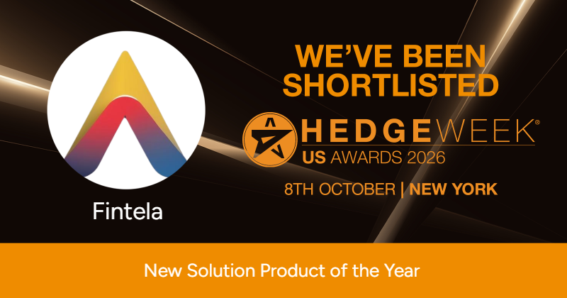

## Why This Matters

The asset management industry is undergoing rapid transformation driven by growing data complexity, tighter margins, and rising client expectations for transparency and performance. Solutions that can turn that complexity into clear, actionable insight are becoming essential rather than optional.

Being shortlisted by Hedgeweek is an acknowledgment from the industry itself that Fintela is building in the right direction: solutions built to support how investment decisions are made, not just add features.

## What This Recognition Reflects

- **Innovation** a different approach to a real problem for asset managers.  
- **Client impact** solutions designed around real workflows, helping teams move faster and make more informed decisions.  
- **Industry validation** recognition from an established, respected voice in hedge fund and asset management coverage.

## What Fintela is

Fintela is a web platform for building, backtesting, optimizing and trading quantitative portfolios. You define a universe of instruments, write the rule that turns market data into a signal, declare the objective that rule should be scored on, and Fintela searches the rule's parameter space for you, leaving one backtested candidate portfolio for every completed trial, ready to rank, compare, promote and deploy against a brokerage account. Research, testing, optimization, results and deployment all live in one workspace behind a single sign in. The [documentation overview](/docs/overview) is the map of the platform, and [Fintela for hedge funds](/solutions/hedge-funds) covers what changes for an institutional desk: concurrent studies, cryptographic provenance and broker-connected execution in one cloud workspace your desk does not have to run.

## The Road Ahead

This shortlisting is a meaningful milestone, but it's also a signal of where Fintela is headed. The team remains focused on continuing to innovate, refine, and expand the platform's capabilities to meet the evolving needs of the asset management industry.

Fintela looks forward to representing this work at the Hedgeweek US Awards 2026 ceremony in New York on October 8th, alongside other companies recognized in the awards. To see the platform for yourself before then, [book a walkthrough](/contact) with the team.

## Acknowledgments

This recognition would not be possible without the dedication of the Fintela team and the trust of our clients, whose partnership continues to shape and validate the platform's direction.

---

**Fintela — Future Investing.**

*\#Fintela \#HedgeweekAwards2026 \#Fintech \#FutureInvesting \#AssetManagement*  
