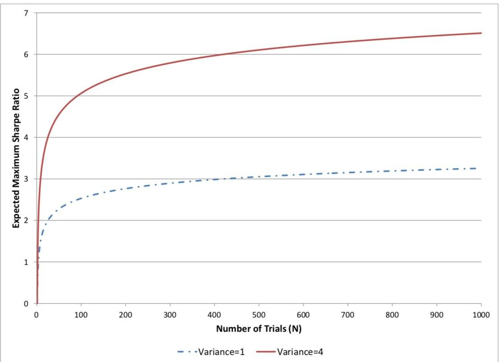

Every optimization engine, ours included, does the same basic thing underneath whatever [sampler](/docs/sampler-selection) is driving it: it tries many parameter combinations and reports back the one that scored best. That process is exactly how a genuinely good strategy gets found, and it's also exactly how a mediocre or useless one gets dressed up to look good, and the two cases are statistically indistinguishable from the final number alone. The number of [trials](/docs/studies) it took to get there is not a footnote. It's the missing half of the result.

## Why more trials quietly inflates the answer

Suppose a strategy has no real edge at all, and its true Sharpe ratio is zero. Backtest returns are noisy, so any single trial will still produce some Sharpe ratio above or below zero just from sampling variation. Now run N independent trials of this same skill-less strategy, varying only some parameter that doesn't actually matter, and keep the best one. The expected value of that maximum grows with N, even though nothing about the underlying strategy changed. For N independent draws from a standard normal distribution, a standard result gives the expected maximum as approximately:

```
E[max Sharpe] ≈ sqrt(2 · ln(N))
```

At 10 trials that's already around 2.1 standard deviations of pure noise; at 1,000 trials it's closer to 3.7. An optimization engine that searches a few hundred or a few thousand parameter combinations, which is a perfectly ordinary thing to do, will hand back a Sharpe ratio that looks statistically significant even when the strategy underneath is doing nothing at all. This is the same phenomenon as multiple hypothesis testing in any other empirical science, just wearing a financial name.

## What the Deflated Sharpe Ratio corrects for

Bailey and López de Prado formalized a correction for exactly this in 2014, built around the idea of treating the number of independent trials, N, as a parameter you have to account for rather than ignore. The starting point is the Probabilistic Sharpe Ratio, which asks how confident you can be that a strategy's true Sharpe ratio exceeds some benchmark, given the estimated Sharpe, the sample length, and the skewness and kurtosis of the return distribution, since a Sharpe ratio estimated from a skewed or fat-tailed return series is noisier than the same number estimated from something closer to normal:

```
PSR(SR*) = Φ( (SR_hat − SR*) · sqrt(T − 1) / sqrt(1 − skew·SR_hat + ((kurt − 1)/4)·SR_hat²) )
```

where SR_hat is the observed Sharpe ratio, T is the number of return observations, and Φ is the standard normal cumulative distribution function. The Deflated Sharpe Ratio plugs in a specific benchmark for SR*, namely the expected maximum Sharpe ratio you'd get from N skill-less trials, the same quantity from the section above, adjusted for the variance across trials rather than just their count:

```
SR* ≈ sqrt(Var[SR_trials]) · ( (1 − γ)·Φ⁻¹(1 − 1/N) + γ·Φ⁻¹(1 − 1/(N·e)) )
```

with γ the Euler-Mascheroni constant. The result, DSR, is a probability: how likely is it that the strategy's true skill is actually positive, once you've corrected for the fact that you tried N things and kept the best one. A backtest that looked airtight at 3 trials can come out with a DSR uncomfortably close to a coin flip once N climbs into the hundreds, without a single number in the original backtest having changed.

## What this means for how many trials is too many

The uncomfortable implication is not that optimization is bad, it's that N has to be tracked and disclosed as part of the result, the same way a clinical trial has to disclose how many endpoints it tested before reporting the one that came back significant. A study that ran 50 trials and a study that ran 5,000 trials, reporting the identical final Sharpe ratio, are not reporting equivalent evidence of skill, and treating them as equivalent is the most common way a backtest ends up overstating what it found. The fix isn't to run fewer trials out of caution, since a wider search is often exactly what surfaces a real effect. It's to carry N forward into how the final number gets interpreted, rather than discarding it the moment the best trial gets selected. That is also why a finished Fintela study reports Deflated Sharpe, Probabilistic Sharpe and a probability of backtest overfitting as a separate [robustness check](/docs/metrics-reference), computed once per study rather than offered as a metric you can rank on.

## Further reading

- [Studies](/docs/studies): how a study searches a strategy's parameter space, and what each trial leaves behind.
- [Sampler selection](/docs/sampler-selection): which search algorithm to pick, and the trial budget each one expects.
- [Study lifecycle](/docs/study-lifecycle): when the robustness step runs relative to the optimization itself.

Sources: Bailey, D. and López de Prado, M. (2014), The Deflated Sharpe Ratio: Correcting for Selection Bias, Backtest Overfitting, and Non-Normality, Journal of Portfolio Management.
